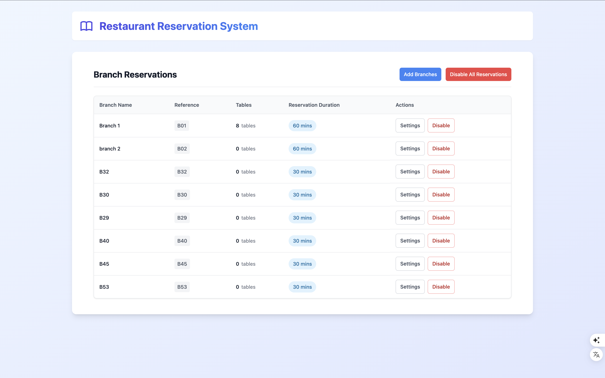
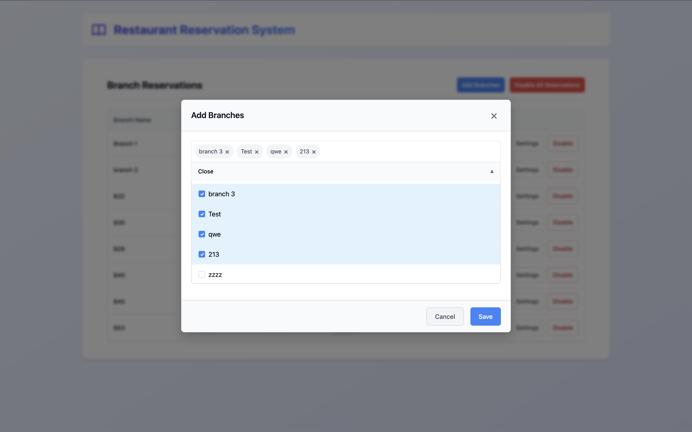
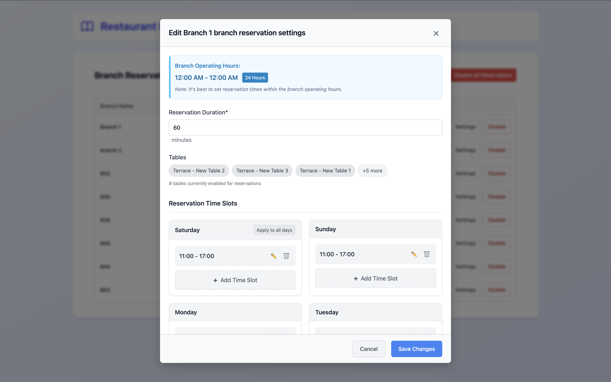
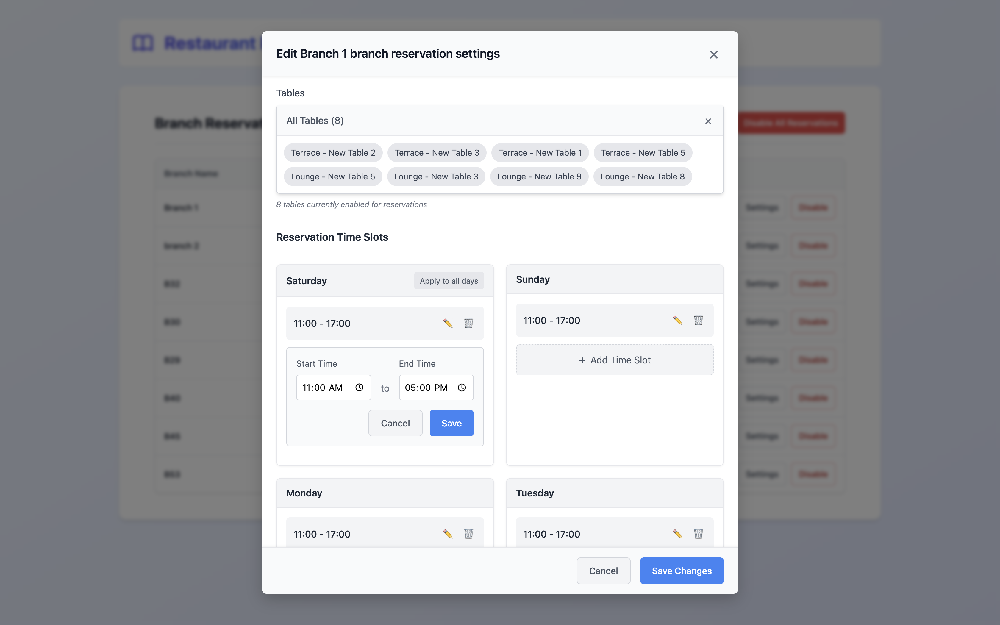
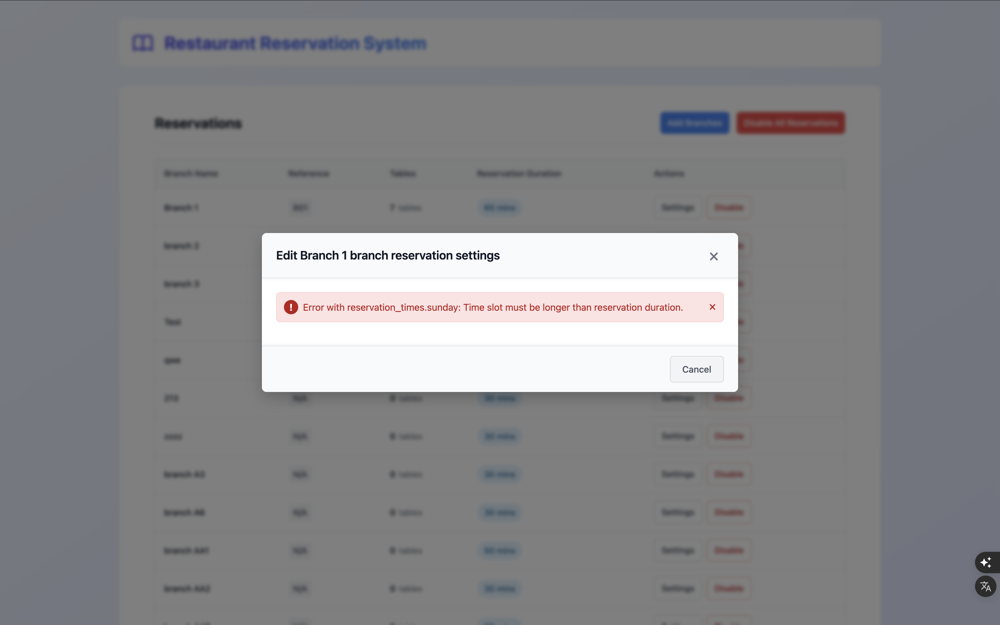
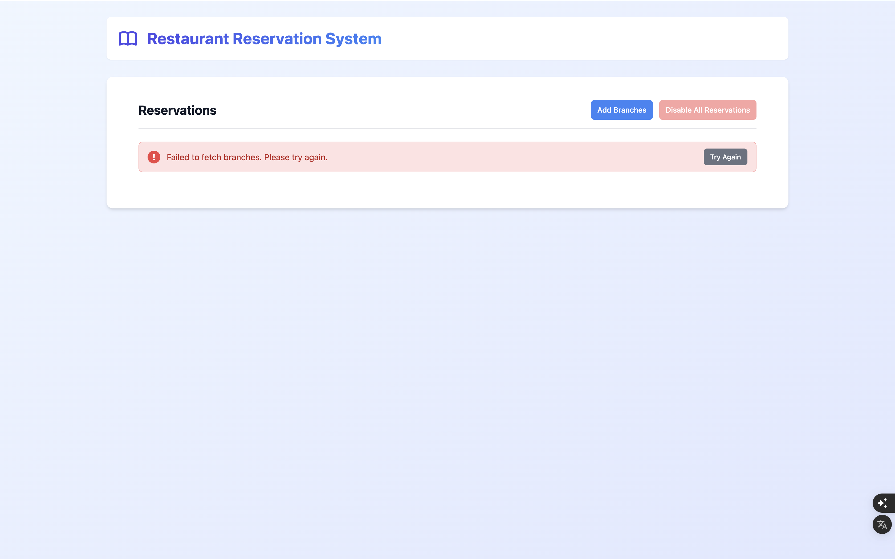

# Restaurant Reservation System

A Vue.js application that allows restaurant owners to manage reservation settings across multiple locations.

- View all branches with reservations enabled
- Disable reservations for individual branches or all branches at once



## Overview

This single-page application helps restaurant owners configure their reservation system across multiple branches. Each branch can have reservations enabled or disabled, and when enabled, specific settings can be configured:

- **Reservation Duration**: The number of minutes a reservation is expected to last
- **Tables**: Which tables within the branch are open for reservations
- **Time Slots**: Available time slots for each day of the week (up to 3 per day)

## Features

### Branch Management

- Add new branches to reservation system


_Listing page showing all branches with enabled reservations_

### Branch Settings

- Configure reservation duration per branch
- Set up time slots for each day of the week
- Copy time slot configuration from Saturday to all other days with a single click


_Branch reservation settings configuration_

### Time Slot Management

- Add, edit and delete time slots for each day
- Up to 3 time slots per day
- Intuitive time slot editing interface


_Editing a time slot for a specific day_

### Error Handling

The application implements a comprehensive error handling system:

- Global error handling using Axios interceptors
- User-friendly error messages displayed in the UI.
  
  

## Setup Instructions

### Prerequisites

- Node.js (v12 or later)
- npm (v6 or later) or yarn

### Installation

1. Clone the repository
2. Install dependencies:

   ```bash
   npm install
   # OR
   yarn install
   ```

### Environment Configuration

The project uses a `.env` file for environment variables. A sample configuration is provided in [.env](file:.env):

```
VUE_APP_API_BASE_URL=https://api.foodics.dev/v5
VUE_APP_FOODICS_TOKEN=[your-auth-token]
```

Make sure to update the token value if needed.

### Development Server

Start the local development server with:

```bash
npm run serve
# OR
yarn serve
```

The application will be available at `http://localhost:8080/` with hot-reload for development.

### Building for Production

To create a production build:

```bash
npm run build
# OR
yarn build
```

The compiled assets will be output to the `dist/` directory.

## Code Quality Tools

This project is set up with code quality tools to maintain high code standards:

### ESLint

ESLint is configured to enforce consistent code style. You can run the linter with:

```bash
npm run lint
# OR
yarn lint
```

This will check all files and automatically fix issues where possible.

### Prettier

Prettier ensures consistent code formatting across the project. To format all files:

```bash
npm run format
# OR
yarn format
```

This will format all JavaScript, Vue, JSON and CSS files according to the project's Prettier configuration.

## API Documentation

This project uses the Foodics API. All requests include the authorization bearer token specified in the environment variables.

- Base URL: `https://api.foodics.dev/v5/`
- API Documentation: [Foodics API Docs](https://apidocs.foodics.com/core/introduction.html)
- Reservation System Guide: [Foodics Reservation Guide](https://developers.foodics.com/guides/reservations.html#reservation-feature)
